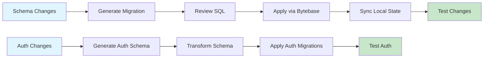

# Database Schema & Auth Management

## 📚 Documentation Overview

This documentation provides comprehensive workflows for managing database schemas and authentication in the senseiiwyze-dashboard project using **Drizzle ORM** and **Bytebase** for migrations.

## 🎯 Quick Start

### For New Developers
1. **Read**: [Quick Commands Reference](./quick-commands.md) - Essential commands for daily work
2. **Follow**: [Decision Tree](./decision-tree.md) - Choose the right workflow for your task
3. **Learn**: [Command Workflow](./command-workflow.md) - Complete workflow documentation

### For Daily Work
```bash
# Schema changes
pnpm db:generate    # Generate migrations
pnpm db:pull        # Sync with database

# Auth changes  
pnpm auth:generate  # Update auth schema
pnpm auth:migrate   # Apply auth migrations

# Testing
pnpm test           # Run tests
```

## 📖 Documentation Structure

### Core Workflows
- **[Command Workflow](./command-workflow.md)** - Complete workflow with Mermaid flowcharts
- **[Decision Tree](./decision-tree.md)** - Choose the right workflow for your scenario
- **[Quick Commands](./quick-commands.md)** - Essential commands for daily use

### Migration Management
- **[Bytebase Migration Workflow](./bytebase-migration-workflow.md)** - Bytebase-specific migration process
- **[Quick Reference](./quick-reference.md)** - Bytebase workflow quick reference

### Architecture & Setup
- **[Better Auth Integration](./better-auth-account-context-integration.md)** - Auth integration details
- **[Database Schema](./supabase-database-schema.md)** - Database schema documentation

## 🔄 Workflow Overview



## 🛠️ Key Technologies

- **Drizzle ORM** - Type-safe database toolkit
- **Better Auth** - Authentication system
- **Bytebase** - Database migration management
- **PostgreSQL** - Database engine
- **Supabase** - Database hosting

## 🚀 Common Scenarios

### Adding New Tables
```bash
# 1. Edit schema
vim src/lib/db/drizzle/schema.ts

# 2. Generate migration
pnpm db:generate

# 3. Apply via Bytebase
# 4. Sync state
pnpm db:pull

# 5. Test
pnpm test
```

### Updating Auth
```bash
# 1. Update auth config
vim auth.ts

# 2. Regenerate auth schema
pnpm auth:generate

# 3. Apply migrations
pnpm auth:migrate

# 4. Test auth
pnpm test
```

### Emergency Rollback
```bash
# 1. Create rollback in Bytebase
# 2. Apply rollback migration
# 3. Sync local state
pnpm db:pull

# 4. Fix issues and repeat
```

## 🔍 Troubleshooting

### Common Issues

| Issue | Solution |
|-------|----------|
| "No schema changes" | Normal - schema is in sync |
| Schema conflicts | Run `pnpm db:pull` to sync |
| Auth conflicts | Backup schema and resolve manually |
| Bigint precision | Use `{ mode: "bigint" }` |

### Getting Help

1. **Check**: [Troubleshooting Guide](./command-workflow.md#troubleshooting-guide)
2. **Review**: [Decision Tree](./decision-tree.md) for workflow selection
3. **Test**: Run `pnpm test` to verify changes
4. **Document**: Update documentation if you find new solutions

## 📋 Best Practices

### Schema Design
- Use semantic table and column names
- Include proper foreign key relationships
- Add appropriate indexes for performance
- Use correct data types (avoid `any`)

### Migration Safety
- Always review generated SQL before applying
- Test migrations in development first
- Keep database backups before major changes
- Use Bytebase for production migrations

### Team Collaboration
- Document schema changes in commit messages
- Review migrations with team members
- Use feature branches for schema changes
- Coordinate auth updates with schema changes

## 🔗 Related Documentation

- [Cursor Rules](../cursor-rules/) - Development environment rules
- [Project Plans](./plans/) - Feature and component plans
- [Tasks](./tasks/) - Current development tasks
- [Sessions](./sessions/) - Development session notes

## 📞 Support

For questions or issues:

1. **Check existing documentation** - Most issues are covered here
2. **Review troubleshooting guides** - Common solutions provided
3. **Test thoroughly** - Ensure changes work as expected
4. **Document solutions** - Help future developers

---

**Remember**: Always review generated SQL before applying via Bytebase, and test thoroughly before deploying to production! 