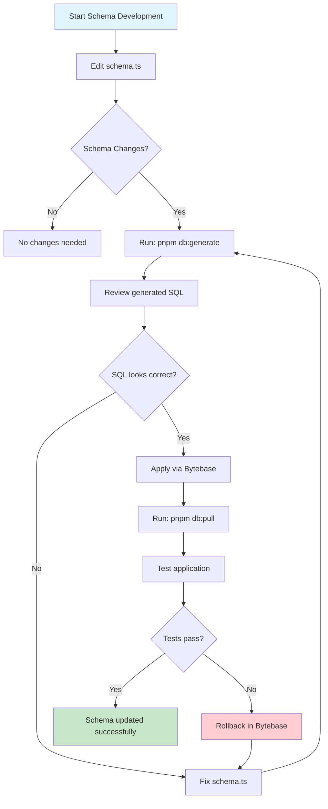
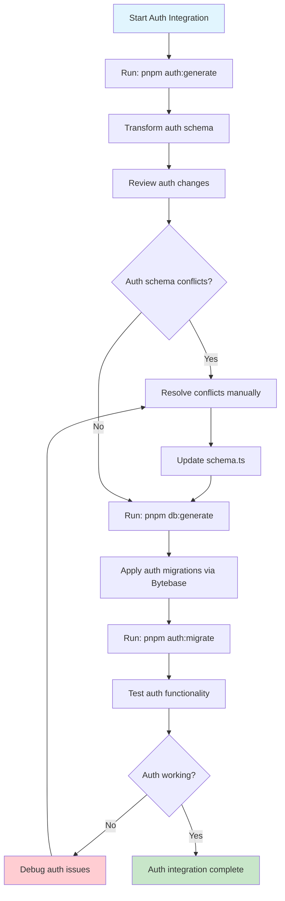
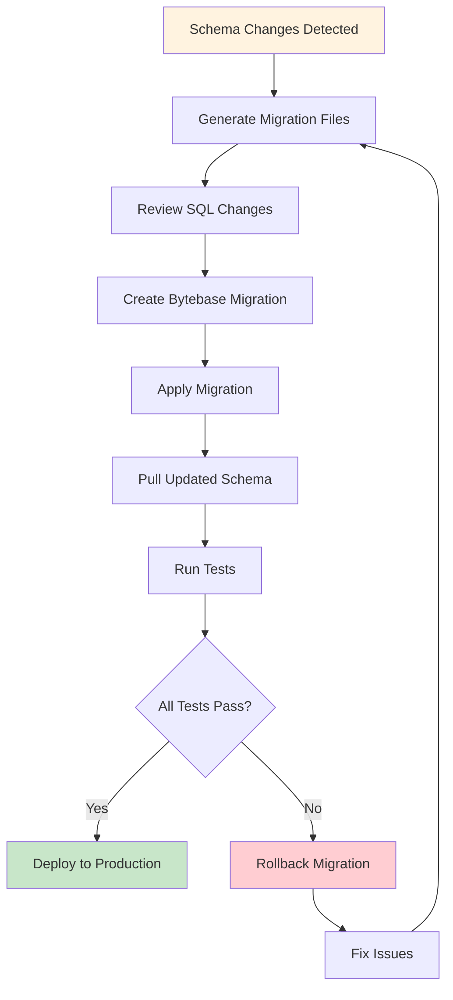
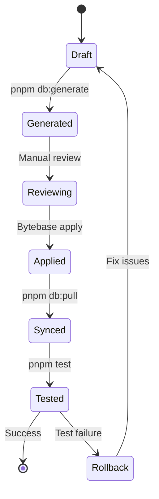

# Command Workflow: Schema & Auth Management

## Overview

This document outlines the complete workflow for managing database schemas and authentication in the senseiiwyze-dashboard project using Drizzle ORM and Bytebase for migrations.

## 🎯 Workflow Goals

- **Schema Management**: Generate, review, and apply database schema changes
- **Auth Integration**: Seamlessly integrate Better Auth with existing schemas
- **Migration Safety**: Use Bytebase for controlled, auditable migrations
- **Team Collaboration**: Clear process for schema changes and reviews

---

## 📊 Workflow Flowcharts

### 1. Schema Development Workflow



### 2. Auth Integration Workflow



### 3. Complete Migration Workflow



---

## 🛠️ Command Reference

### Schema Management Commands

| Command | Purpose | When to Use |
|---------|---------|-------------|
| `pnpm db:generate` | Generate migration files from schema changes | After editing `schema.ts` |
| `pnpm db:pull` | Sync local schema state with database | After Bytebase applies migrations |
| `pnpm fix-schema` | Fix schema import issues | Before generating migrations |
| `pnpm migrate:drizzle` | Complete migration workflow | Full schema update process |

### Auth Management Commands

| Command | Purpose | When to Use |
|---------|---------|-------------|
| `pnpm auth:generate` | Generate Better Auth schema | Initial auth setup or updates |
| `pnpm auth:migrate` | Apply auth migrations | After auth schema changes |
| `pnpm migrate:auth` | Complete auth migration workflow | Full auth update process |

### Development Commands

| Command | Purpose | When to Use |
|---------|---------|-------------|
| `pnpm dev` | Start development server | Local development |
| `pnpm build` | Build for production | Before deployment |
| `pnpm test` | Run test suite | After schema changes |
| `pnpm lint` | Check code quality | Before committing |

---

## 📋 Step-by-Step Workflows

### Workflow 1: Adding New Schema Tables

```bash
# 1. Edit schema.ts to add new tables
vim src/lib/db/drizzle/schema.ts

# 2. Generate migration files
pnpm db:generate

# 3. Review generated SQL
cat src/lib/db/drizzle/0005_new_table.sql

# 4. Apply via Bytebase (manual step)
# - Go to Bytebase dashboard
# - Create new migration
# - Paste SQL content
# - Apply migration

# 5. Sync local state
pnpm db:pull

# 6. Test changes
pnpm test
```

### Workflow 2: Updating Existing Tables

```bash
# 1. Edit schema.ts to modify tables
vim src/lib/db/drizzle/schema.ts

# 2. Generate migration files
pnpm db:generate

# 3. Review SQL for data safety
cat src/lib/db/drizzle/0006_modify_table.sql

# 4. Apply via Bytebase with backup
# - Create database backup in Bytebase
# - Apply migration
# - Verify data integrity

# 5. Sync and test
pnpm db:pull
pnpm test
```

### Workflow 3: Auth Schema Integration

```bash
# 1. Generate Better Auth schema
pnpm auth:generate

# 2. Transform auth schema (automatic)
# Script runs: node scripts/transform-auth-schema.js

# 3. Review auth changes
cat src/lib/db/drizzle/schema.ts

# 4. Generate migration files
pnpm db:generate

# 5. Apply auth migrations
pnpm auth:migrate

# 6. Test auth functionality
pnpm test
```

### Workflow 4: Emergency Rollback

```bash
# 1. Identify problematic migration
# Check Bytebase migration history

# 2. Create rollback migration
# In Bytebase: Create new migration with rollback SQL

# 3. Apply rollback
# Execute rollback migration in Bytebase

# 4. Sync local state
pnpm db:pull

# 5. Fix original issue
# Edit schema.ts and repeat normal workflow
```

---

## 🔍 Troubleshooting Guide

### Common Issues & Solutions

#### Issue: "No schema changes, nothing to migrate"
**Cause**: Schema is already in sync with database
**Solution**: This is normal - no action needed

#### Issue: "Schema conflicts detected"
**Cause**: Local schema differs from database
**Solution**: 
```bash
pnpm db:pull  # Sync with database
# Then make your changes
pnpm db:generate
```

#### Issue: "Auth schema transformation failed"
**Cause**: Better Auth schema conflicts with existing tables
**Solution**:
```bash
# 1. Backup current schema
cp src/lib/db/drizzle/schema.ts src/lib/db/drizzle/schema.backup.ts

# 2. Regenerate auth schema
pnpm auth:generate

# 3. Manually resolve conflicts
vim src/lib/db/drizzle/schema.ts

# 4. Test integration
pnpm db:generate
```

#### Issue: "Bigint precision error"
**Cause**: JavaScript number precision limits
**Solution**: Use `{ mode: "bigint" }` for large integers
```typescript
// ❌ Wrong
id: bigint({ mode: "number" }).primaryKey()

// ✅ Correct  
id: bigint({ mode: "bigint" }).primaryKey()
```

---

## 📊 Migration Status Tracking

### Migration States



### Migration Checklist

- [ ] Schema changes made in `schema.ts`
- [ ] Migration files generated (`pnpm db:generate`)
- [ ] SQL reviewed for correctness
- [ ] Migration applied via Bytebase
- [ ] Local state synced (`pnpm db:pull`)
- [ ] Tests passing (`pnpm test`)
- [ ] Documentation updated
- [ ] Team notified of changes

---

## 🚀 Best Practices

### Schema Design
- Use semantic table and column names
- Include proper foreign key relationships
- Add appropriate indexes for performance
- Use correct data types (avoid `any`)

### Migration Safety
- Always review generated SQL before applying
- Test migrations in development first
- Keep database backups before major changes
- Use Bytebase for production migrations

### Team Collaboration
- Document schema changes in commit messages
- Review migrations with team members
- Use feature branches for schema changes
- Coordinate auth updates with schema changes

---

## 📚 Additional Resources

- [Drizzle ORM Documentation](https://orm.drizzle.team/)
- [Better Auth Documentation](https://auth.better-auth.com/)
- [Bytebase Migration Guide](https://www.bytebase.com/docs)
- [PostgreSQL Data Types](https://www.postgresql.org/docs/current/datatype.html)

---

*Last updated: $(date)* 