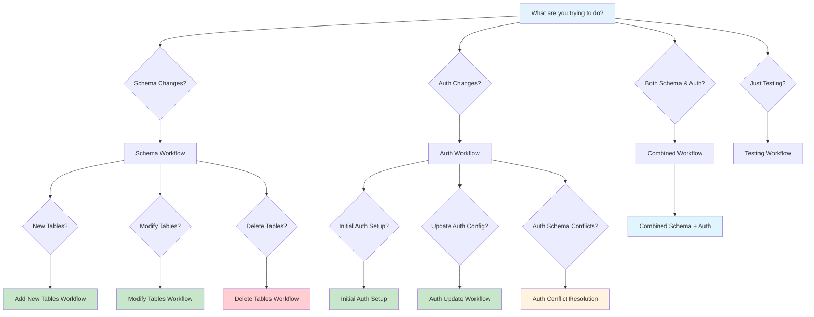

# Decision Tree: Schema & Auth Workflows

## 🎯 When to Use Which Workflow



## 📋 Workflow Selection Guide

### 🆕 New Table Addition
**When**: Adding completely new tables to the schema
**Workflow**: Schema Development Workflow
**Commands**:
```bash
# 1. Edit schema.ts
vim src/lib/db/drizzle/schema.ts

# 2. Generate migration
pnpm db:generate

# 3. Review SQL
cat src/lib/db/drizzle/*.sql

# 4. Apply via Bytebase
# 5. Sync state
pnpm db:pull

# 6. Test
pnpm test
```

### 🔄 Table Modification
**When**: Changing existing table structure (columns, types, constraints)
**Workflow**: Schema Development Workflow + Backup
**Commands**:
```bash
# 1. Backup database (in Bytebase)
# 2. Edit schema.ts
vim src/lib/db/drizzle/schema.ts

# 3. Generate migration
pnpm db:generate

# 4. Review SQL carefully
cat src/lib/db/drizzle/*.sql

# 5. Apply via Bytebase
# 6. Sync state
pnpm db:pull

# 7. Test thoroughly
pnpm test
```

### 🗑️ Table Deletion
**When**: Removing tables from the schema
**Workflow**: Schema Development Workflow + Data Backup
**Commands**:
```bash
# 1. Backup data (in Bytebase)
# 2. Edit schema.ts
vim src/lib/db/drizzle/schema.ts

# 3. Generate migration
pnpm db:generate

# 4. Review SQL for data safety
cat src/lib/db/drizzle/*.sql

# 5. Apply via Bytebase
# 6. Sync state
pnpm db:pull

# 7. Test
pnpm test
```

### 🔐 Initial Auth Setup
**When**: First time setting up Better Auth
**Workflow**: Auth Integration Workflow
**Commands**:
```bash
# 1. Generate auth schema
pnpm auth:generate

# 2. Review auth changes
cat src/lib/db/drizzle/schema.ts

# 3. Generate migration
pnpm db:generate

# 4. Apply auth migrations
pnpm auth:migrate

# 5. Test auth
pnpm test
```

### ⚙️ Auth Configuration Update
**When**: Changing auth settings, providers, or policies
**Workflow**: Auth Integration Workflow
**Commands**:
```bash
# 1. Update auth config
vim auth.ts

# 2. Regenerate auth schema
pnpm auth:generate

# 3. Review changes
cat src/lib/db/drizzle/schema.ts

# 4. Generate migration
pnpm db:generate

# 5. Apply migrations
pnpm auth:migrate

# 6. Test auth
pnpm test
```

### ⚠️ Auth Schema Conflicts
**When**: Better Auth schema conflicts with existing tables
**Workflow**: Auth Conflict Resolution
**Commands**:
```bash
# 1. Backup current schema
cp src/lib/db/drizzle/schema.ts src/lib/db/drizzle/schema.backup.ts

# 2. Regenerate auth schema
pnpm auth:generate

# 3. Manually resolve conflicts
vim src/lib/db/drizzle/schema.ts

# 4. Test integration
pnpm db:generate

# 5. Apply migrations
pnpm auth:migrate

# 6. Test thoroughly
pnpm test
```

### 🔄 Combined Schema + Auth
**When**: Making both schema and auth changes simultaneously
**Workflow**: Combined Workflow
**Commands**:
```bash
# 1. Make schema changes
vim src/lib/db/drizzle/schema.ts

# 2. Update auth config
vim auth.ts

# 3. Generate auth schema
pnpm auth:generate

# 4. Review all changes
cat src/lib/db/drizzle/schema.ts

# 5. Generate migration
pnpm db:generate

# 6. Apply migrations
pnpm auth:migrate

# 7. Test everything
pnpm test
```

### 🧪 Testing Only
**When**: Just running tests or checking status
**Workflow**: Testing Workflow
**Commands**:
```bash
# Check migration status
pnpm db:generate

# Check auth status
pnpm auth:generate

# Run tests
pnpm test

# Check linting
pnpm lint
```

## 🚨 Emergency Scenarios

### Schema Rollback
**When**: Migration caused issues and needs to be undone
**Workflow**: Emergency Rollback
**Commands**:
```bash
# 1. Identify problematic migration in Bytebase
# 2. Create rollback migration in Bytebase
# 3. Apply rollback
# 4. Sync local state
pnpm db:pull

# 5. Fix original issue
# 6. Repeat normal workflow
```

### Auth Rollback
**When**: Auth changes broke authentication
**Workflow**: Auth Emergency Rollback
**Commands**:
```bash
# 1. Restore backup schema
cp src/lib/db/drizzle/schema.backup.ts src/lib/db/drizzle/schema.ts

# 2. Generate migration
pnpm db:generate

# 3. Apply rollback via Bytebase
# 4. Sync state
pnpm db:pull

# 5. Fix auth issues
# 6. Repeat auth workflow
```

## 📊 Decision Matrix

| Scenario | Primary Workflow | Backup Needed | Review Level | Testing Level |
|----------|------------------|---------------|--------------|---------------|
| New Table | Schema | No | Medium | Standard |
| Modify Table | Schema | Yes | High | Thorough |
| Delete Table | Schema | Yes | High | Thorough |
| Initial Auth | Auth | No | Medium | Standard |
| Auth Update | Auth | No | Medium | Standard |
| Auth Conflicts | Auth | Yes | High | Thorough |
| Combined | Combined | Yes | High | Thorough |
| Testing | Testing | No | Low | Standard |

---

**Remember**: When in doubt, always backup first and review generated SQL carefully! 