# Senseii Platform - Task Delegation & Development Plan

## 🎯 Quick-Start Task Breakdown

### Phase 0: Foundation (Day 1 - Critical Path)
**Owner: Tech Lead**
```yaml
task_id: FOUND-001
duration: 4 hours
deliverables:
  - Base routing structure
  - Layout components
  - Mock data service
  - Component library setup

mini_tasks:
  - Create route config: 1hr
  - Build Layout wrapper: 1hr
  - Setup mock API endpoints: 1hr
  - Configure design tokens: 1hr

blocking: ALL_OTHER_TASKS
```

### Phase 1: Parallel Page Development (Days 2-3)

#### Task Group A: Executive Dashboard (`/org`)
**Owner: Senior Frontend Dev**
```yaml
task_id: ORG-001
duration: 1.5 days
dependencies: [FOUND-001]
complexity: MEDIUM

subtasks:
  - ORG-001.1: KPI Card Component (4hrs)
    deliverable: Reusable KPICard with animation
    
  - ORG-001.2: Executive Layout (2hrs)
    deliverable: 2x2 grid responsive layout
    
  - ORG-001.3: Mock Data Integration (2hrs)
    deliverable: Connected to mock metrics
    
  - ORG-001.4: Quick Actions (4hrs)
    deliverable: Screenshot, Present, Export modals

integration_points:
  - exports: [KPICard, MetricDisplay]
  - consumes: [Layout, MockAPI]
```

#### Task Group B: Team Dashboard (`/team`)
**Owner: Mid-level Frontend Dev**
```yaml
task_id: TEAM-001
duration: 2 days
dependencies: [FOUND-001]
complexity: HIGH

subtasks:
  - TEAM-001.1: Data Table Component (6hrs)
    deliverable: Sortable, filterable table
    
  - TEAM-001.2: Filter Panel (4hrs)
    deliverable: Collapsible sidebar filters
    
  - TEAM-001.3: Bulk Actions (3hrs)
    deliverable: Multi-select with action bar
    
  - TEAM-001.4: Row Actions (3hrs)
    deliverable: Dropdown menu per row

integration_points:
  - exports: [DataTable, FilterPanel]
  - consumes: [Layout, MockAPI]
```

#### Task Group C: My Progress (`/me`)
**Owner: Frontend Dev**
```yaml
task_id: ME-001
duration: 1.5 days
dependencies: [FOUND-001]
complexity: MEDIUM

subtasks:
  - ME-001.1: Progress Ring Component (3hrs)
    deliverable: Animated skill-fit display
    
  - ME-001.2: Coaching Cards (3hrs)
    deliverable: Stackable intervention cards
    
  - ME-001.3: Personal Metrics Grid (4hrs)
    deliverable: 3-column responsive grid
    
  - ME-001.4: Chart Components (6hrs)
    deliverable: Radar, Trend, Heatmap

integration_points:
  - exports: [ProgressRing, CoachingCard]
  - consumes: [Layout, MockAPI, Charts]
```

### Phase 2: Integration & Cross-Links (Day 4)

#### Task Group D: Navigation Flow
**Owner: Tech Lead + All Devs**
```yaml
task_id: INT-001
duration: 1 day
dependencies: [ORG-001, TEAM-001, ME-001]

subtasks:
  - INT-001.1: Deep Linking (2hrs)
    deliverable: Click-through from Org → Team → Profile
    
  - INT-001.2: State Management (3hrs)
    deliverable: Filter persistence, user context
    
  - INT-001.3: Role-Based Routing (2hrs)
    deliverable: Automatic redirects by role
    
  - INT-001.4: Loading States (1hr)
    deliverable: Skeleton screens, spinners
```

## 🔄 Structure Change Protocol

### How to Modify Structure Mid-Flight

```yaml
change_request_process:
  1_identify:
    - What: "Component needs different props"
    - Impact: "Affects 2 other components"
    - Urgency: "HIGH/MEDIUM/LOW"
    
  2_communicate:
    - Post in: "#senseii-dev"
    - Tag: "@affected-developers"
    - Template: "CHANGE: [component] needs [modification] because [reason]"
    
  3_implement:
    quick_changes:  # < 30 min
      - Add optional props
      - Change styling
      - Add new mock data fields
      
    breaking_changes:  # Needs coordination
      - Change component interface
      - Modify routing structure
      - Update data schema

structure_flexibility_rules:
  - Keep interfaces loose initially (many optional props)
  - Use composition over inheritance
  - Mock data can be changed anytime
  - Style changes don't block functionality
```

## 📋 Task Assignment Template

### Quick Copy-Paste for Delegation

```markdown
## Task: [TASK-ID] - [Component/Page Name]
**Assigned to**: @developer
**Due**: [Date]
**Blocked by**: [Dependencies]

### Deliverables:
- [ ] Component renders with mock data
- [ ] Responsive on mobile/tablet/desktop  
- [ ] Props documented in comments
- [ ] Basic error states handled

### Integration checklist:
- [ ] Exports listed in index.ts
- [ ] Uses shared Layout component
- [ ] Connects to MockAPI service
- [ ] Navigation links work

### Definition of Done:
- [ ] Screenshot posted in Slack
- [ ] PR created with description
- [ ] Tested on Chrome/Safari
- [ ] No console errors

**Questions?** Post in #senseii-dev
```

## 🚀 Parallel Development Strategy

### Day 1 - Setup Sprint

```mermaid
gantt
    title Day 1 Tasks
    dateFormat HH:mm
    section Foundation
    Layout Components    :done, 09:00, 2h
    Routing Setup       :done, 09:00, 2h
    Mock API           :active, 11:00, 2h
    Design Tokens      :active, 11:00, 2h
```


### Days 2-3 - Page Sprint

```mermaid
gantt
    title Days 2-3 Parallel Development
    dateFormat HH:mm
    section Org Dashboard
    KPI Cards          :a1, 09:00, 4h
    Layout             :a2, after a1, 2h
    Integration        :a3, after a2, 2h
    
    section Team Dashboard
    Data Table         :b1, 09:00, 6h
    Filters            :b2, 15:00, 4h
    
    section My Progress
    Progress Ring      :c1, 09:00, 3h
    Coaching Cards     :c2, after c1, 3h
    Charts             :c3, 15:00, 6h
```


## 🔌 Integration Points

### Shared Components Registry
```javascript
// src/components/shared/index.ts
export { Layout } from './Layout'
export { KPICard } from './KPICard'
export { DataTable } from './DataTable'
export { ProgressRing } from './ProgressRing'
export { FilterPanel } from './FilterPanel'

// Each dev adds their exports here
```

### Mock API Structure
```javascript
// src/services/mockApi.ts
export const mockApi = {
  // Executive Dashboard
  getKPIs: async () => ({ 
    completion: 87.3,
    costPerCompletion: 284,
    atRiskCount: 23,
    readinessIndex: 58.4
  }),
  
  // Team Dashboard
  getLearners: async (filters) => ({
    data: [...],
    total: 156,
    page: 1
  }),
  
  // My Progress
  getMyMetrics: async (userId) => ({
    skillFit: 73,
    visionAlignment: 0.82,
    gameIndex: 0.91
  })
}
```

## 🏁 Quick Start Commands

```bash
# Each developer runs these
git checkout -b feature/[TASK-ID]
npm run dev
npm run mock-api

# Component generator
npm run generate component [ComponentName]

# Test your page
npm run test:page [pageName]
```

## 📊 Progress Tracking

### Daily Standup Template
```yaml
yesterday:
  - Completed: [Component names]
  - Blockers: [Any issues]

today:
  - Working on: [Task IDs]
  - Need from others: [Dependencies]

questions:
  - [Any integration concerns]
```

### Slack Channels
- `#senseii-dev` - General development
- `#senseii-blockers` - Urgent issues
- `#senseii-pr` - PR reviews
- `#senseii-demo` - Share progress

## 🎯 Success Metrics

**Day 3 Goal**: All pages load with mock data
**Day 4 Goal**: Navigation works between all pages
**Day 5 Goal**: Ready for backend integration

This structure allows everyone to work independently while maintaining clear integration points and communication channels.